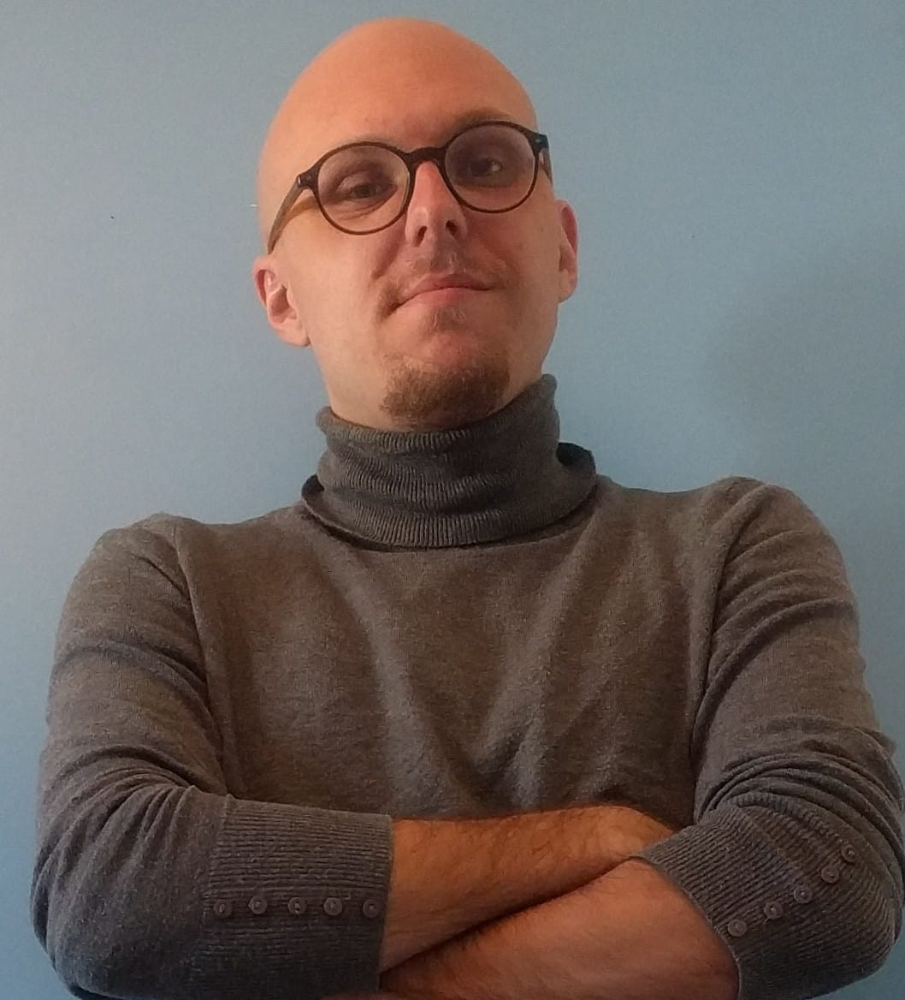

----------------  -------------------------  ---------------------------
Rodrigue GASPARD  Junior Software Developer  {width=20%}
----------------  -------------------------  ---------------------------

Born 28th of October, 1996

:envelope: - [rodriguegaspard@gmail.com](mailto:rodriguegaspard@gmail.com)

:bust_in_silhouette: - [\underline{LinkedIn}](https://www.linkedin.com/in/rodriguegaspard/)

:desktop_computer: - [\underline{GitHub}](https://www.linkedin.com/in/rodriguegaspard/)

----

# About myself
After obtaining a __bachelor's degree in computer science__ at the University of Angers in France, I worked as a __software developer__ in an art school for a year and a half. I'm currently looking for a __Master's degree and an internship in Southeast Asia in software development__ in order to learn new skills and to practice English at a professional level.
I'm very passionate about computer science, as it provide me with skills and tools that are very useful in my daily activities, and also it gives me interesting challenges that motivates me to push myself forward. I mainly use Arch Linux as my operating system.

# Work experience

__ESAD TALM__ - _Software Developer_ - (03/2021 - 10/2022)

* Conception and creation of a relational database using FileMaker
* Development and creation of graphical user interfaces
* Management of financial transactions, such as automatic withdrawals and online payments
* Account management
* File generation (.pdf, .xlsx, .xml, .csv)
* Redaction of a technical documentation and a user's guide
* Formation of users and interns

# Academic background

__MyDigitalSchool__ (2021-2022)

* Web frameworks (Vue.Js, React Native)
* Design patterns and object-oriented programming with C# 
* Git

__University of Angers__ - _Bachelor of Computer Science_ (09/2016 - 06/2020)

* Object-oriented programming with C++ and Java
* Language theory and functional programming with OCaml
* Logical programming with Prolog
* 3D modeling with OpenGL
* Computer architecture and x86 assembly
* SQL
* UNIX
* Scripting with Python, Perl and Bash

# Skills

* _Operating system_ : Windows, GNU/Linux
* _Software_ : GNU Core utilities, plantuml, pandoc, ffmpeg, gimp, git, Office suite

# Hobbies

* Astronomy, aeronautics and astronautics
* Litterature
* Cinema
* Natation

